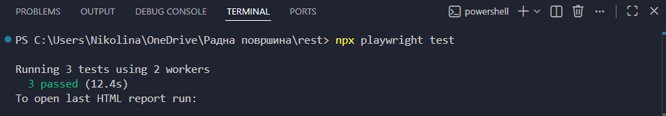
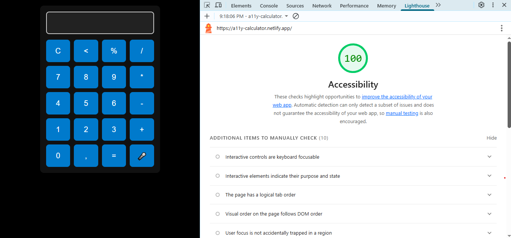

# 🧮 Accessible Voice Calculator

An advanced web application built with a core focus on **Digital Accessibility (a11y)** and **Inclusive User Experience**.

### 🏆 Verification & Results
- **Manual Testing:** Full compatibility with **NVDA** (Windows) and **TalkBack** (Android).
- **Automated Testing:** Zero violations found using **Playwright + Axe-core** in automated test runs.

- **100/100 Accessibility Score** (Verified by Google Lighthouse).

### ✨ Modern Features
- **Voice UI:** Integrated **Web Speech API** for hands-free calculations (HMI focus).
- **Advanced Navigation:** Manual focus management via **Roving Tabindex** (crucial for automotive HMI).

### ⚠️ A Note on `eval()`
I'm aware that using `eval()` is generally not a best practice for production code due to security concerns. I used it here for simplicity and demonstration of the core logic. In a real-world system, I would implement a custom parser or leverage a library like `Math.js` to ensure robust and secure expression evaluation.

### 🛠 Tech Stack
- Vanilla JavaScript, HTML5, CSS3.
- Playwright, Axe-core, Lighthouse.
- Standards: WCAG 2.2 AA compliant.
